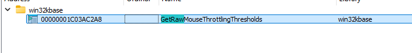
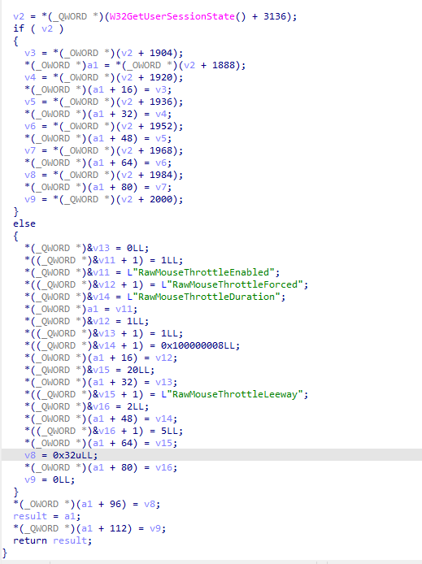
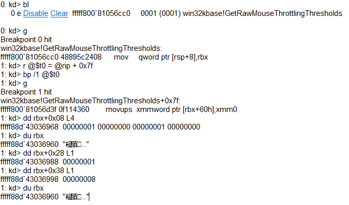
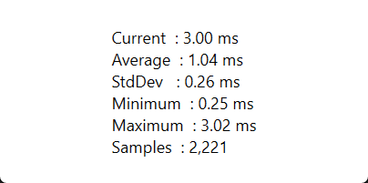
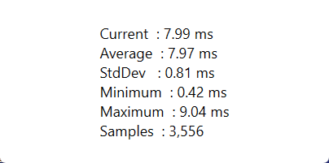
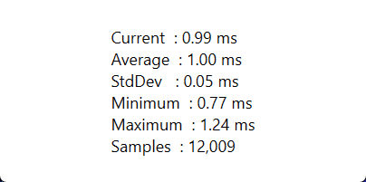
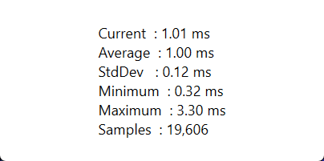

I wanted to know whether the new **Raw Mouse Throttle** code Microsoft shipped with KB 5028185 really adds input lag in games.
Here’s what I uncovered, step by step, without ever seeing extra delay in an active window.

#### Finding the code

* While browsing the public PDBs in IDA, I noticed a brand-new export called **`GetRawMouseThrottlingThresholds`** in *win32kfull.sys*.

* Cross-references showed the real body lives in *win32kbase.sys*. That routine reads—or, if absent, inserts—four registry values under **HKCU\Control Panel\Mouse**:
  `RawMouseThrottleEnabled`, `RawMouseThrottleForced`, `RawMouseThrottleDuration`, `RawMouseThrottleLeeway`.

#### Confirming the defaults

* I attached WinDbg to a live system, set a breakpoint just after the values are loaded, and dumped the struct.
  The hard-coded defaults confirmed by WinDbg are:

  * *Enabled = 1*, *Forced = 0*, *Duration = 1 ms*, and *Leeway = 8 ms*.

#### Version check

* On a clean Windows 11 **22H2** image taken **before** KB 5028185, the function simply doesn’t exist, and the registry is never touched.
* On **23H2** and **24H2**, it is present and runs once at logon.

#### Building a test harness

* I wrote **RawMouseThrottleBufferTester** (C# / WPF) that measures the gap between consecutive `WM_INPUT` messages.
* The tester can register the mouse with `InputSink`.

#### Measurements in the wild

* Windows 10 22H2 shows \~1 ms gaps everywhere—there is no throttle layer at all.
* Windows 11 23H2 and 24H2 show \~1 ms in the foreground but jump to \~8 ms (≈125 Hz) as soon as the window loses focus or is registered with `InputSink`.
  
  
* On Windows 24H2, I tested with all registry values set to `0`, effectively turning it off. Both foreground and background windows show consistent \~1 ms intervals.
  
  

### Additional latency verification

* I measured end-to-end latency from mouse click to photon sensor detection using a photodiode sensor. There was no measurable difference (≤0.1 ms) between default, throttled, and disabled settings. See the detailed results in my test spreadsheet: [Latency Tests Spreadsheet](https://docs.google.com/spreadsheets/d/1BnH8CYYTgWBivtEDolHfyC8xLQEXJTN_3CB1rHg_Y6o/edit?gid=0).

### What this means

* **KB 5028185 introduced both the registry keys and the throttling logic.**
  Earlier builds have neither.
* The mechanism exclusively targets background RAW listeners; the foreground path bypasses it entirely. As a result, games in focus maintain true polling-rate latency (\~1 ms on a 1000 Hz mouse) regardless of the registry.
* I have included default and "off" registry files for testing purposes.

In simple terms, these new registry keys only affect background processes and reduce CPU usage when high-polling-rate mice interact with applications like Discord or Steam that capture raw input, causing unnecessary CPU cycles on every mouse movement. It's best to leave these settings untouched; tweaking them won't enhance gaming performance, and any perceived improvements are likely placebo.
